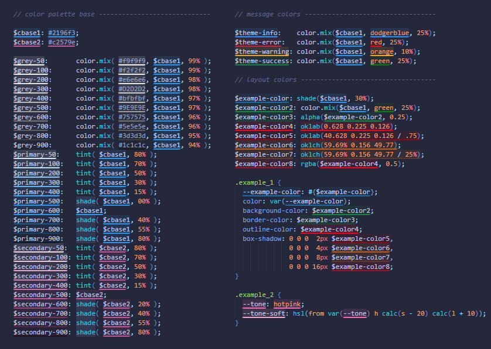

# DG SCSS Color Preview

Inline color previews for SCSS variables, CSS custom properties, and derived color tokens.

DG SCSS Color Preview is designed for projects where colors are not only defined as direct literals, but also through SCSS variables, chained token systems, interpolation, and custom helper functions.

Instead of only previewing plain values such as `#2196f3` or `rgb(...)`, the extension follows references and resolves resulting colors where possible. This makes it especially useful in codebases with semantic color tokens and derived palette systems.

## Why this extension is useful

This extension includes support for custom SCSS helper patterns, including functions such as:

```scss
@function alpha($color, $alpha) {
  @return unquote("color-mix(in srgb, " + $color + " " + ($alpha * 100%) + ", transparent)");
}

@function tint($color, $percentage) {
  @return color.mix(white, $color, $percentage);
}

@function shade($color, $percentage) {
  @return color.mix(black, $color, $percentage);
}
```

## Example Screenshot



The goal is to make these structures easier to read at a glance by showing the resulting color directly in the editor.

## Features

- Inline underline-based color previews without adding extra spacing to the editor layout
- Resolves chained variable references and derived token values
- Resolves CSS custom properties such as `--primary-500` and related token exports
- Supports interpolation such as `#{$primary-500}`
- Supports color derivation via:
  - `color.mix(...)`
  - `mix(...)`
  - custom `tint(...)`
  - custom `shade(...)`
  - custom `alpha(...)`
- Supports `var(--token)` references
- Supports direct color literals such as:
  - hex values
  - `rgb(...)`
  - `rgba(...)`
  - `hsl(...)`
  - `hsla(...)`
  - `oklab(...)`
  - `oklch(...)`
- Supports standard CSS color names such as `white`, `black`, `red`, `orange`, `green`, or `dodgerblue`
- Avoids duplicate decorations where a resolved token and a nested literal would otherwise overlap

## Best suited for

DG SCSS Color Preview is particularly useful in projects with:

- SCSS design tokens
- semantic color systems
- derived palette scales
- custom color helper functions
- CSS custom property exports
- larger codebases where colors are reused through variables instead of being hardcoded repeatedly

## Installation

The repository already includes a packaged `.vsix` file. You can install it via **Extensions → ... → Install from VSIX...**.

If you want to inspect, modify, or test the extension locally, open the project folder in VS Code and press `F5` to launch it in an Extension Development Host.

## Command

- `SCSS Color Preview: Refresh`

## Notes

DG SCSS Color Preview is intentionally focused on practical SCSS and CSS color workflows. It is not a full Sass compiler, but it is built to handle the kinds of token and reference structures commonly used in real-world projects.

It is particularly useful for developers who want more informative color previews in variable-driven styling systems than standard literal-only previews usually provide.